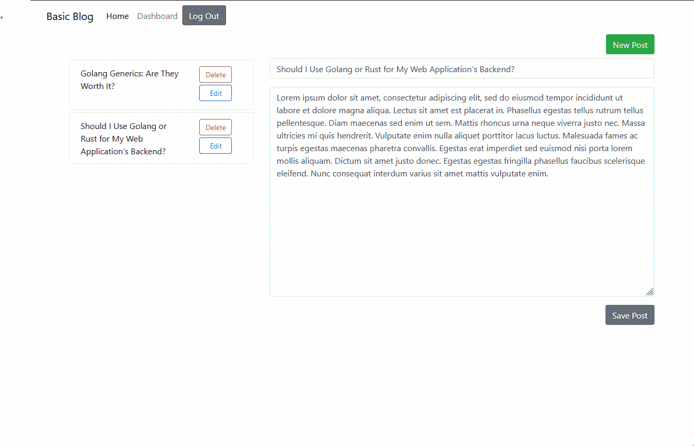

# Basic Blog

## Description
This basic blogging application allows users to create and manage their own blog posts, and to comment on the blog posts of other users.  Once a user has signed up by creating an account with a username and a password, they are able to author their first blog post by navigating to the dashboard.  Signed in users can see and create comments on all posts by choosing one from the homepage.  
**[Basic Blog Live Example]()**
## Installation
For local development:
1. Clone this repository: `git clone git@github.com:kitrath/basic-blog`
2. Navigate to the base directory: `cd basic-blog`
3. Install dependencies: `npm install`
4. Create a `.env` file in the base directory.  Provide your database connection information (see [./config/connection.js](config/connection.js)).
4. Create the database. Log in to the mysql cli client with `mysql -u <username> -p`, then `source db/schema.sql`.
5. Seed the database: `npm run seed`.
6. Start the server: `npm start`
7. Visit `http://localhost:3001` in your browser
## Usage
Click the Sign Up link in the top navigation bar and use the sign up form to create an account with a password (at least 8 characters).  Visit the homepage to see blog posts written by all users.  Choose the Read More link to see a single blog with its comments, where you can add your own.  Choose Dashboard from the top navigation to be taken to a page where you can write your first blog.  Once you've written a blog, you can come back to the Dashboard page (where you'll find a list of all the blogs you've created) to edit or delete it.

## Screenshot

